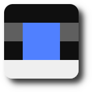

# icostring



[](https://github.com/xyproto/icostring/actions/workflows/build.yml) [](https://goreportcard.com/report/github.com/xyproto/icostring) [](https://raw.githubusercontent.com/xyproto/icostring/main/LICENSE)

Generate a file in the ICO format from a short string of either **16** or **64** characters (`'a'..'p', 'q' and 't'`) + an optional hex encoded color value, for example `tttttqqttqqttttt`.

The idea is that this can be used for quickly specifying a `favicon.ico` file, either with a command line utility, or when writing web applications in Go.

Both a Go module and the `icostring` utility are provided.

### Quick installation

For Go 1.21, the latest version of the `icostring` utility can be installed with:

    go install github.com/xyproto/icostring/cmd/icostring@latest

### Example use

```go
package main

import (
    "log"
    "os"

    "github.com/xyproto/icostring"
)

func WriteFile(filename, imageString string) error {
    f, err := os.Create(filename)
    if err != nil {
        return err
    }
    if err := icostring.WriteImage(f, imageString); err != nil {
        return err
    }
    return f.Close()
}

func main() {
    if err := WriteFile("favicon.ico", "aaaafqqfaqqapppp"); err != nil {
        log.Fatalln(err)
    }
}
```

Here `aaaafqqfaqqapppp` is used, but `aaaaaaaa aaaqqaaa ffqqqqff ffqqqqff aaqqqqaa aaqqqqaa pppqqppp pppppppp #08f` is also a valid icostring.

### String format

* The string represents a 4x4 or 8x8 image that will be scaled up to 16x16 when it is converted to an ICO.
* The string is a maximum of 73 characters long (letters + hex color). Spaces are ignored.
* The first 4 or 8 characters is the top row, the next series of letters is the second row etc.
* `a` is the darkest grayscale color, `b` is a bit lighter etc. up to `p` which is the lightest grayscale color.
* `q` is a custom color that is either red, or defined at the end of the string with a hex color, either with or without alpha, like `#ffffffff` or `#fff`.
* `t` is transparent.

#### Example short form image strings and images

* A dark image: `aaaaaaaaaaaaaaaa` (`a` is the darkest grayscale color)
* A blue image: `qqqqqqqqqqqqqqqq#00f`. (`q` is the custom color that is optionally defined at the end of the string).
* A red image: `qqqqqqqqqqqqqqqq` (the default custom color is red, `#f00`)
* A dark gray square surrounded by transparent pixels: `tttt taat taat tttt`.
* A yellow square surrounded by transparent pixels: `tttttqqttqqttttt#ff0`.
* A tiny icostring logo: `aaaafqqfaqqapppp#5080ff`.

| aaaaaaaaaaaaaaaa                  | qqqqqqqqqqqqqqqq                  | tttttaattaattttt                             | aaaafqqfaqqapppp#5080ff                     |
| --------------------------------- | --------------------------------- | -------------------------------------------- | ------------------------------------------- |
|  |   |      |             |

### General info

* Version: 1.2.1
* License: BSD-3
* Author: Alexander F. Rødseth &lt;xyproto@archlinux.org&gt;
